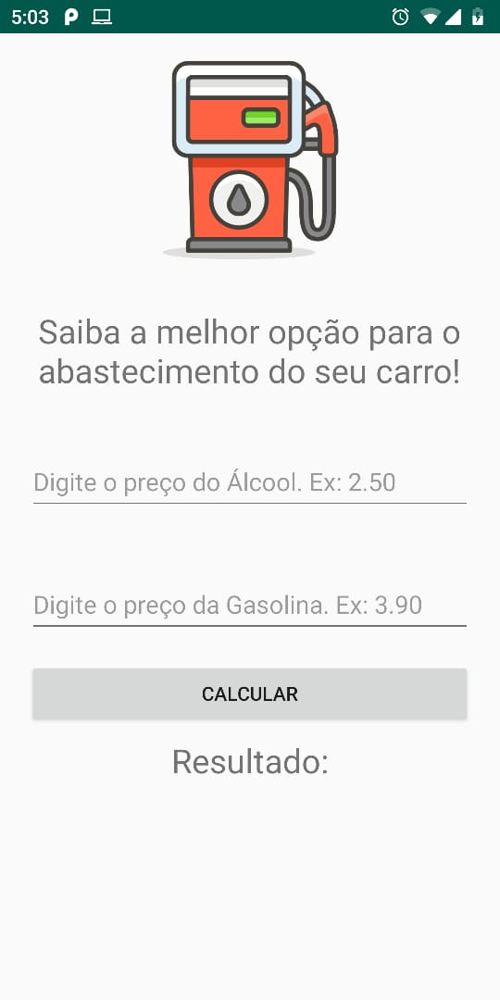
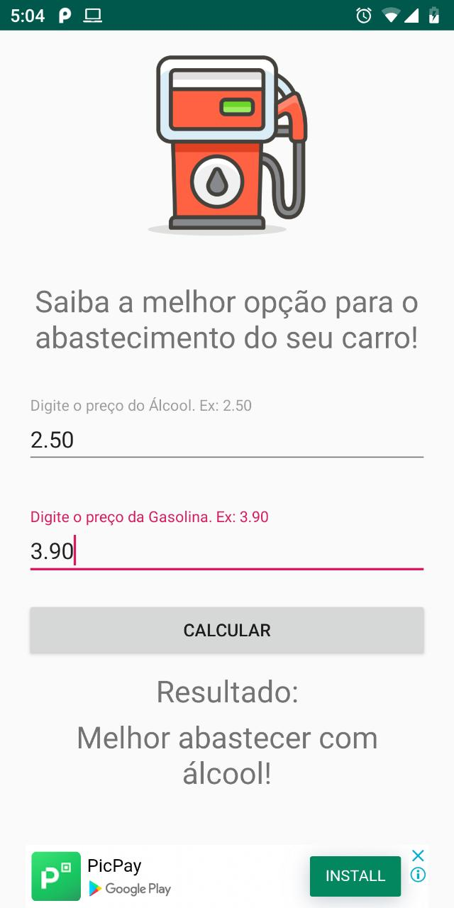

#Esse é o app Alcool ou Gasolina, desenvolvido para fins didáticos.

#Linguagem JAVA.

#O aplicativo recebe o preço do alcool e o preço da gasolina que o usuário inserir, e em seguida retorna qual combustível está mais em conta.

#Esse app está diponível na PlayStore, link: https://play.google.com/store/apps/details?id=com.igorsantos.alcoolougasolina

